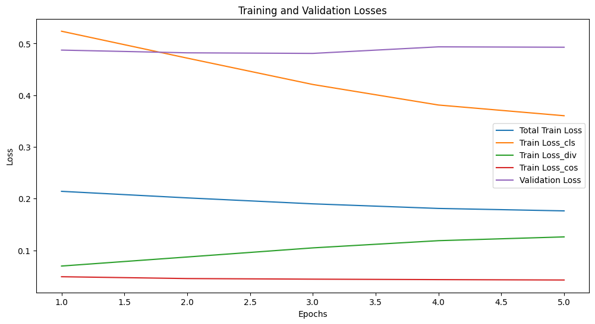
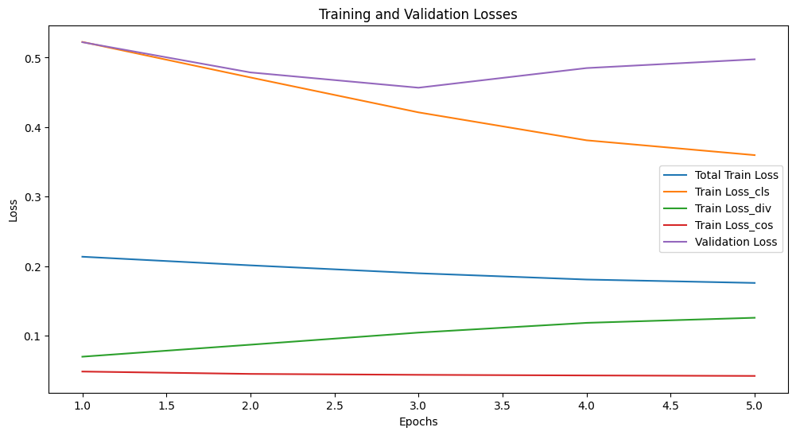
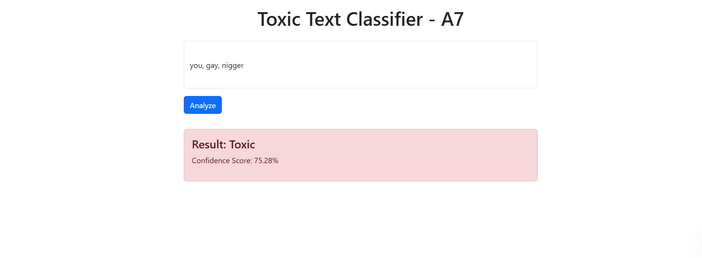

# NLP Assignment 7 - Toxic Text Classification

This project implements a toxic text classification system using DistilBERT with LoRA fine-tuning. The application is containerized using Docker for easy deployment.

## Project Structure

```
.
├── app/                  # Main application code
│   ├── main.py          # Dash web application
│   └── requirements.txt  # Python dependencies
├── distilBERT_LoRA.ipynb # Model training notebook
├── Dockerfile           # Container configuration
├── docker-compose.yml   # Docker compose configuration
├── even_student_result.json  # Model evaluation results
├── odd_student_result.json   # Model evaluation results
└── figures/             # Training and evaluation plots
```

## Features

1. **Toxic Text Classification**
   - Uses a custom DistilBERT model fine-tuned with on English Hate Speech Superset('manueltonneau/english-hate-speech-superset')
   - Classifies text as toxic or non-toxic
   - Provides confidence scores for predictions

2. **Web Interface**
   - Built with Dash and Bootstrap
   - Clean and intuitive UI
   - Real-time text analysis

3. **Containerized Deployment**
   - Docker and Docker Compose support
   - Easy deployment and scaling
   - Environment isolation

## Requirements

- Docker and Docker Compose
- Python 3.10.12
- Required Python packages (see requirements.txt):
  - dash==2.14.2
  - transformers==4.36.2
  - dash-bootstrap-components
  - torch==2.2

## Setup and Running

1. Build and start the containers:
```bash
docker compose up --build
```

2. Access the application:
- Web interface: http://localhost:9999

## Model Details

The project uses a DistilBERT model fine-tuned on the English Hate Speech Superset dataset for toxic text classification. Here are the key details:

1. **Dataset**
   - **Source**: English Hate Speech Superset (`manueltonneau/english-hate-speech-superset`)
   - **Size**: 360,493 posts
   - **Sources**: Multiple social media platforms including Twitter, Reddit, Gab, YouTube, and more
   - **Labels**: Binary classification (0: no_hate, 1: hate)

2. **Model Architecture**
   - **Base Model**: DistilBERT (a distilled version of BERT)
   - **Fine-tuning**: Trained on hate speech classification
   - **Output Classes**: Two classes (no_hate, hate)

3. **Data Split**
   - Training set: 86,517 samples (30% of original dataset)
   - Validation set: 10,815 samples
   - Test set: 10,815 samples

4. **Training Configuration**
   - Random seed: 42 for reproducibility
   - GPU acceleration: CUDA enabled
   - Environment: Python 3.10.12
   - Dependencies:
     - transformers==4.36.2
     - torch==2.2
     - datasets

5. **Model Performance**
   - The model's performance metrics are stored in:
     - `even_student_result.json`
     - `odd_student_result.json`

6. **Training Plots**

| Even Layer   | Odd Layer  |
|--------------------------|--------------------------------|
|  |  |
   
7. **Evaluation**

| Model Type | Training Loss | Test Loss | Test Accuracy |
|------------|---------------|-----------|--------------|
| Odd Layer  | 0.176068     | 0.492750  | 0.816828     |
| Even Layer | 0.176234     | 0.492161  | 0.818215     |
| LoRA       | 0.399200     | 0.418820  | 0.809986     |

8. **Web Interface**

| Web Interface |
|--------------------------|
|  |

## Discussion

In terms of training loss, the distillation models (both odd and even) are twice as good as LoRA models(12 layers). However, significant performance differences are not observed on the test set although there is still a small margin for better loss and accuracy (test) in the distillation models.

There are three different losses in distillation models, in which the KL divergence loss needs to be implemented from scratch. Then, selecting and copying the weights from larger models to smaller models needs a little bit more effort than usual. These two will be the main challenges in implementing distillation models. On the other hand, since the peft module from huggingface is used to implement LoRA, there is no similar challenge. However, there is some are dependency issues among the packages, which need to be solved for some time. Nevertheless, These challenges in implementation are solvable although there are some modifications like creating classes for more efficiency.

Regarding the performances of the models, although the distillation fine-tuning is better, these models seem to overfit as the test set performances are that much different. Hence, training more iteration will not help the performances. On the other hand, training more iterations with LoRA might achieve the better performances. Finally, I have trained the models with only 100k data of overall 300k data due to computational resources. Increasing the data size will help the performances
